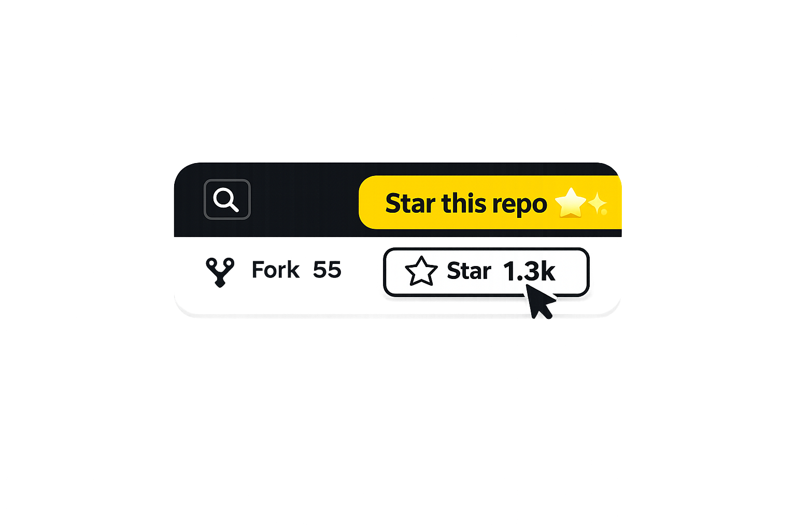

# gh-star-gif



## Try it now!

```bash
npx gh-star-gif https://github.com/shinshin86/gh-star-gif
```

Generate an animated GIF that opens a GitHub repository page, highlights the Star button, moves a fake cursor toward it, and shows an emoji-heavy callout message prompting viewers to star the repo.


## What it does

1. Opens the GitHub repo page in a headless Chromium browser (via Playwright)
2. Locates the Star button using multiple strategies (role, aria-label, form action)
3. Injects an overlay with a dimmed spotlight, pulsing ring, animated cursor, and tooltip
4. Records the viewport as a video
5. Converts the video to an optimized GIF using ffmpeg (two-pass palette generation)

The result is a short, eye-catching GIF you can embed in READMEs, tweets, or docs.

## Prerequisites

- **Node.js 20+**
- **ffmpeg** on PATH (for video-to-GIF conversion)
- **Playwright browsers** (installed via `npx playwright install`)

### Installing ffmpeg

| Platform | Command |
|----------|---------|
| macOS    | `brew install ffmpeg` |
| Ubuntu   | `sudo apt-get install ffmpeg` |
| Windows  | `choco install ffmpeg` or download from [ffmpeg.org](https://ffmpeg.org/download.html) |

## Quick start

```bash
# Basic usage — generates ./out/microsoft_TypeScript.gif
npx gh-star-gif https://github.com/microsoft/TypeScript

# Custom message and output path
npx gh-star-gif https://github.com/facebook/react \
  --message "Star it! ⭐✨🚀" \
  --out ./promo.gif

# All options
npx gh-star-gif https://github.com/owner/repo \
  --out ./custom.gif \
  --message "Star this repo ⭐👆" \
  --width 1280 \
  --height 720 \
  --fps 15 \
  --scale 960 \
  --duration 4200 \
  --headful \
  --keep-video \
  --debug
```

When `--keep-video` is set, the video is saved next to `--out` with the same basename and a `.webm` extension.

## Install

```bash
# Global install
npm install -g gh-star-gif

# Or local install (recommended for projects)
npm install -D gh-star-gif
```

After installing, you can run:

```bash
gh-star-gif https://github.com/microsoft/TypeScript
# or
npx gh-star-gif https://github.com/microsoft/TypeScript
```

## Install from source (for development)

```bash
git clone https://github.com/your-username/gh-star-gif.git
cd gh-star-gif
npm install
npx playwright install --with-deps chromium
npm run build
```

### Using with `npm run start`

```bash
npm run start -- https://github.com/microsoft/TypeScript
npm run start -- https://github.com/facebook/react --message "Star it ⭐✨"
```

### Using during development

```bash
npm run dev -- https://github.com/microsoft/TypeScript --debug
```

## CLI Reference

```
gh-star-gif <repoUrl>

Arguments:
  repoUrl                  GitHub repository URL

Options:
  --out <path>             Output GIF path (default: ./out/<owner>_<repo>.gif)
  --message <text>         Tooltip text (default: "Star this repo ⭐👆")
  --width <number>         Viewport width (default: 1280)
  --height <number>        Viewport height (default: 720)
  --fps <number>           GIF frames per second (default: 15)
  --scale <number>         Output GIF width in pixels (default: 960)
  --duration <ms>          Total capture duration in ms (default: 4200)
  --headful                Run browser in headful mode (default: false)
  --keep-video             Keep intermediate recorded video (saved next to --out as .webm)
  --debug                  Extra logs and keep temp dir (default: false)
  -V, --version            Output version number
  -h, --help               Display help
```

## URL Normalization

The tool accepts various GitHub URL forms and normalizes them:

| Input | Normalized |
|-------|-----------|
| `https://github.com/owner/repo` | `https://github.com/owner/repo` |
| `https://github.com/owner/repo/` | `https://github.com/owner/repo` |
| `https://github.com/owner/repo?tab=code` | `https://github.com/owner/repo` |
| `https://github.com/owner/repo/tree/main/src` | `https://github.com/owner/repo` |
| `github.com/owner/repo` | `https://github.com/owner/repo` |

## Troubleshooting

### ffmpeg not found

```
Error: ffmpeg not found. Please install ffmpeg and ensure it is on your PATH.
```

Install ffmpeg for your platform (see Prerequisites above) and make sure `ffmpeg --version` works in your terminal.

### Star button not found (fallback region used)

```
Note: Star button not found on page. A fallback highlight region was used.
```

This can happen if:
- GitHub changed their page layout
- The repo page has unusual structure
- Network issues caused the page to load incompletely

The tool will still produce a GIF using a fallback region near the top-right of the page where the Star button typically appears. To investigate, run with `--debug` to get a screenshot of the page state.

### Slow network / timeouts

The tool waits up to 60 seconds for the page to load. If you're on a slow connection, the page may not fully render. Try:
- Running again (transient network issues)
- Using `--debug` to inspect what was loaded
- Ensuring your network allows access to github.com

### Playwright browsers not installed

```
Error: Executable doesn't exist at ...
```

Run `npx playwright install --with-deps chromium` to install the required browser.

## Development

```bash
npm install
npm run build       # Compile TypeScript
npm test            # Run unit tests
npm run lint        # Lint source code
npm run format      # Format source code
npm run typecheck   # Type-check without emitting
```

## Project Structure

```
src/
  cli.ts                  CLI entrypoint (commander parsing)
  index.ts                Main orchestrator
  githubUrl.ts            URL normalization and validation
  playwrightCapture.ts    Browser automation and recording
  overlay.ts              Overlay HTML/CSS/JS generation
  ffmpeg.ts               Video-to-GIF conversion
  files.ts                File system utilities
  types.ts                Shared TypeScript types
test/
  githubUrl.test.ts       URL parsing tests
  files.test.ts           File utility tests
```

## License

MIT
